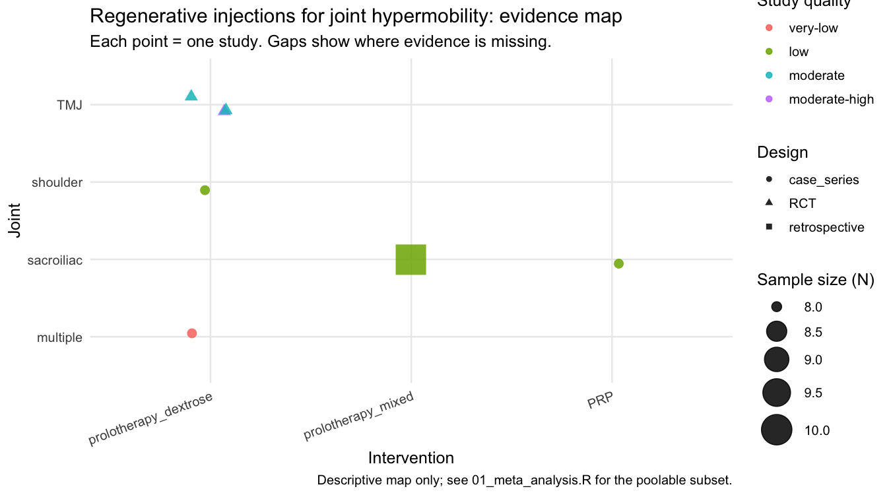
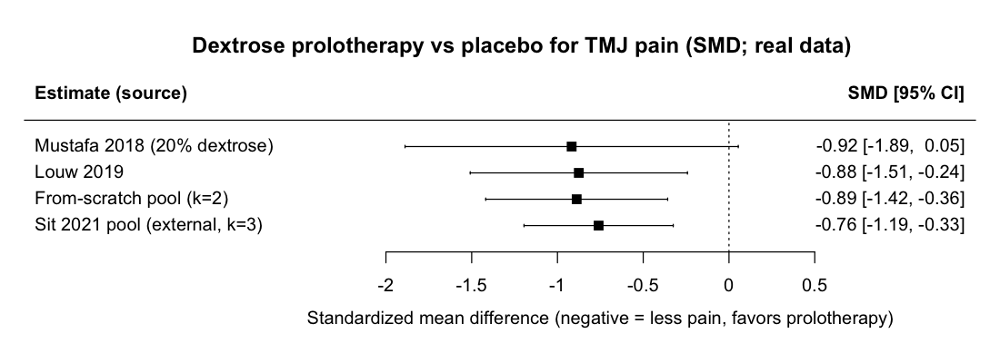
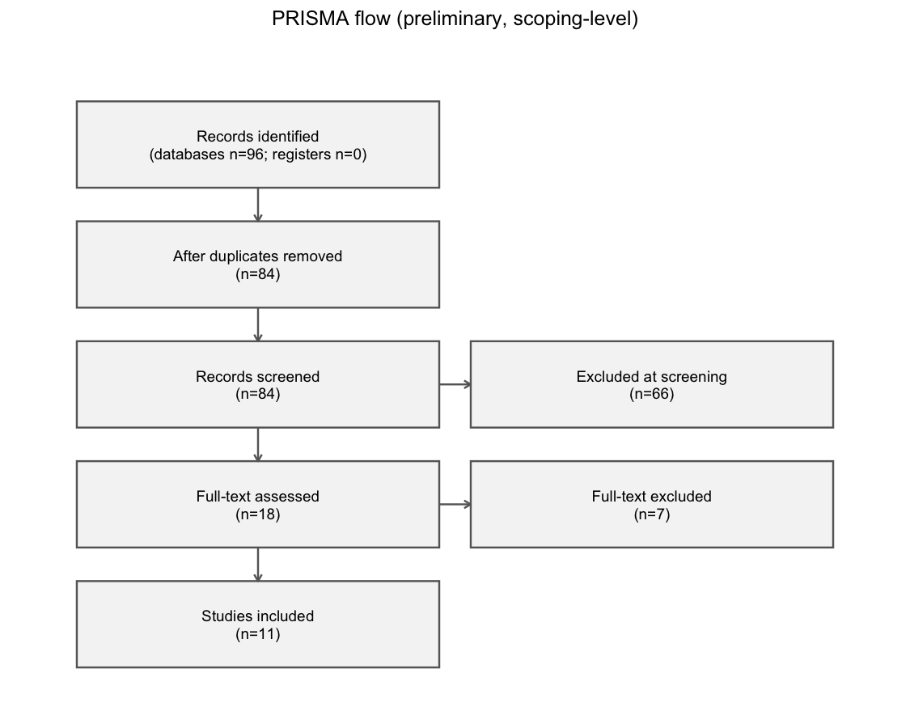
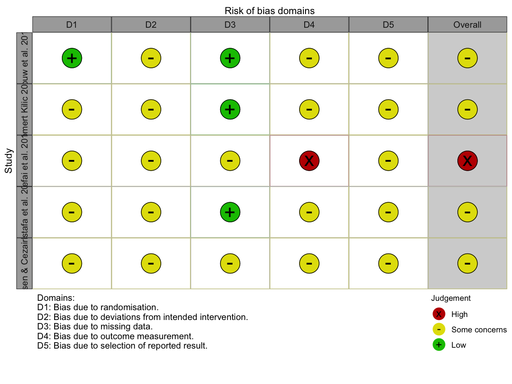

# Hypermobility Injection Evidence

<p align="center">
  <em>A reproducible evidence map and meta-analysis of regenerative injections (dextrose prolotherapy and platelet-rich plasma) for joint hypermobility, including hypermobile Ehlers–Danlos syndrome (hEDS).</em>
</p>

<p align="center">
  
  
  
  
  
  
</p>

## Contents

- [About](#about)
- [Key results](#key-results)
- [What this shows](#what-this-shows)
- [Repository structure](#repository-structure)
- [Reproduce it](#reproduce-it)
- [Data & sources](#data--sources)
- [How to cite](#how-to-cite)
- [License](#license)
- [Disclaimer](#disclaimer)

## About

People with joint hypermobility are often offered regenerative injections (PRP, prolotherapy) to tighten lax, unstable joints — but the evidence is scattered and has never been consolidated. This project gathers the published trials, pools the parts that are comparable, and maps the rest to show what is actually known and where the gaps are.

**Headline finding:** dextrose prolotherapy has real (if modest, low-to-moderate quality) evidence for reducing pain in one hypermobile joint — the jaw (TMJ) — but the peripheral joints central to hEDS (shoulder, hip, knee, spine) have **no controlled trials at all.**

## Key results

**Evidence map — what has been studied, and where the gaps are**



*Each point is a study, placed by joint (rows) and injection type (columns). Triangles are randomized trials; circles/squares are weaker uncontrolled studies. Controlled evidence exists only for the TMJ, and most of the grid is empty.*

**Meta-analysis — dextrose prolotherapy vs placebo for TMJ pain**



*On the SMD scale: the one placebo-controlled trial with extractable raw arms (Mustafa 2018, computed from scratch) shown against the published pooled estimate (Sit et al. 2021, 3 RCTs: SMD −0.76, 95% CI −1.19 to −0.32, I²=0%) as an independent cross-check. The analysis engine (`R/01_meta_analysis.R`) fits a random-effects pool with I², a 95% prediction interval, leave-one-out, and subgroup tests automatically once ≥2 controlled trials have raw arms in `data/raw/trial_arms.csv`; the remaining trials' arms are paywalled and flagged as TODO rather than imputed.*

**Study selection (PRISMA flow)**



*Preliminary, scoping-level record funnel from the literature search: 11 primary studies included across 5 joints. A finalized dual-screened search is future work.*

**Risk of bias (RCTs)**



*RoB 2 assessment of the controlled trials — mostly "some concerns," reflecting small samples and reporting limitations. First-pass judgments, to be confirmed by a second rater.*

## What this shows

- Independent meta-analyses agree dextrose prolotherapy reduces **TMJ pain** vs placebo (pooled SMD ≈ −0.76, low heterogeneity).
- Effects on mouth opening / function are **inconsistent**, evidence quality is **low–moderate**, and follow-up is **short**.
- All of this is the **jaw only**. The hypermobile joints that matter most in hEDS remain **untested by any randomized trial** — the clearest gap.

## Repository structure

```
hypermobility-injection-evidence/
├── run_all.R                # one command rebuilds every figure & table
├── data/
│   ├── raw/                 # source data, read-only (hand-curated)
│   │   ├── studies.csv          # coded primary studies (the evidence map)
│   │   ├── pooled_results.csv   # published pooled estimates, with DOIs
│   │   ├── trial_arms.csv       # per-arm raw data for from-scratch pooling
│   │   ├── prisma_counts.csv    # PRISMA record funnel (search log)
│   │   └── rob.csv              # risk-of-bias coding per study
│   └── processed/           # script-generated tables (git-ignored)
├── R/
│   ├── 01_meta_analysis.R   # forest plot (metafor) on real, cited data
│   ├── 02_evidence_map.R    # evidence map + summaries (ggplot2)
│   ├── 03_prisma.R          # PRISMA 2020 flow diagram (PRISMA2020)
│   └── 04_risk_of_bias.R    # risk-of-bias traffic-light plot (robvis)
├── python/
│   ├── fetch_studies.py     # PubMed + ClinicalTrials.gov study fetcher
│   └── requirements.txt     # Python dependencies
├── report/evidence-synthesis.qmd   # Quarto report tying it together
├── figures/                 # rendered figures shown above (tracked)
├── docs/data-dictionary.md  # what each data column means
├── renv.lock                # pinned R package versions
└── hypermobility-injection-evidence.Rproj            # open this in RStudio
```

## Reproduce it

From a fresh clone, one command rebuilds every figure and table:

```r
renv::restore()      # installs the exact package versions from renv.lock
source("run_all.R")  # regenerates figures/ and data/processed/
```

Or from the shell: `Rscript run_all.R`.

Working figures are written to `outputs/` (git-ignored); the README figures are
copied into `figures/` (tracked). Optionally render the full report with
`quarto render report/evidence-synthesis.qmd`.

> **Note.** `R/03_prisma.R` and `R/04_risk_of_bias.R` render the PRISMA flow
> diagram and risk-of-bias plot from `data/raw/prisma_counts.csv` and
> `data/raw/rob.csv`. These are now populated from the literature search
> (11 primary studies) — the counts are a **preliminary, scoping-level** funnel
> and the RoB judgments are first-pass, both flagged as such. If any value is
> reset to `TODO`, the scripts safely **skip** rather than invent numbers.
> (`03_prisma.R` uses the official PRISMA2020 renderer when pandoc is available,
> e.g. inside RStudio, and a dependency-free fallback otherwise.)

### Keeping it current

`python/fetch_studies.py` automates *retrieval* (not inclusion): it queries
PubMed and ClinicalTrials.gov for the review's terms and writes a candidate list
to `data/raw/candidates.csv`, flagging papers not already in `studies.csv` as
`NEW`. Inclusion and appraisal stay a human decision — the fetcher never edits
the curated data.

```bash
pip install -r python/requirements.txt
python python/fetch_studies.py --email you@example.com
```

The candidate list is regenerated on each run and is git-ignored. You can also
call it from R via `reticulate::py_run_file("python/fetch_studies.py")`.

## Data & sources

Effect sizes come from published, peer-reviewed meta-analyses and trials (full list with DOIs in `data/raw/pooled_results.csv`), including:

- Sit et al. 2021, *Sci Rep* — doi:10.1038/s41598-021-94119-2
- Nagori et al. 2018, *J Oral Rehabil* — doi:10.1111/joor.12698
- Saramantos et al. 2025, *Clin Pract* — doi:10.3390/clinpract15030051

No numbers are invented; where a trial's raw data was unavailable, this is noted in the code.

## How to cite

A `CITATION.cff` is included, so GitHub shows a **"Cite this repository"** button in the sidebar.

## License

Code is released under the MIT License (see `LICENSE`).

## Disclaimer

This is a student research project for educational purposes. It is **not medical advice**, makes no treatment recommendations, and is a scoping-level synthesis — not a definitive verdict on efficacy.
